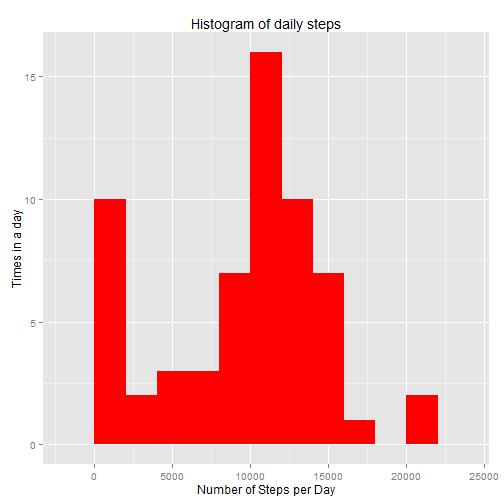
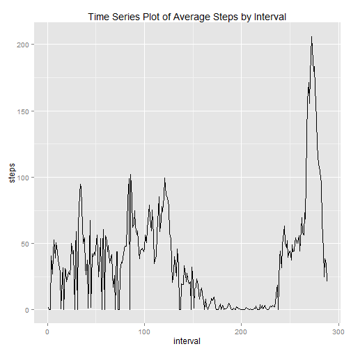
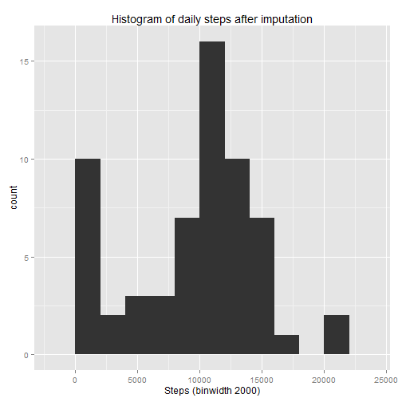
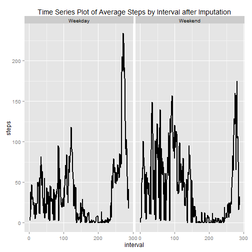

```r
library("knitr")
library("data.table")
library("ggplot2")
```
Ensure knitr, data.table and ggplot2 are installed before hand.


## A. Loading and preprocessing the data.

1.  Load the data (i.e. read.csv())

```r
act_data<-read.csv("./activity.csv",colClasses="character" , na.strings="Not Available")
str(act_data)
```

```
## 'data.frame':	17568 obs. of  3 variables:
##  $ steps   : chr  "NA" "NA" "NA" "NA" ...
##  $ date    : chr  "2012-10-01" "2012-10-01" "2012-10-01" "2012-10-01" ...
##  $ interval: chr  "0" "5" "10" "15" ...
```
2.  Process/transform the data (if necessary) into a format suitable for your analysis

```r
act_data$steps<-as.numeric(act_data$steps)
```

```
## Warning: NAs introduced by coercion
```

```r
act_data$date<-as.Date(act_data$date)  
act_data$interval<-as.factor(act_data$interval)
str(act_data)
```

```
## 'data.frame':	17568 obs. of  3 variables:
##  $ steps   : num  NA NA NA NA NA NA NA NA NA NA ...
##  $ date    : Date, format: "2012-10-01" "2012-10-01" ...
##  $ interval: Factor w/ 288 levels "0","10","100",..: 1 226 2 73 136 195 198 209 212 223 ...
```
## B. What is mean total number of steps taken per day?
Ignoring the missing values in the dataset.

1.  Calculate the total number of steps taken per day

```r
##steps_per_day <- aggregate(steps ~ date, act_data, sum,na.rm=TRUE)
steps_per_day <- aggregate(x = act_data$steps , by = list(act_data$date), FUN = sum ,na.rm=TRUE)
colnames(steps_per_day) <- c("date","steps")
head(steps_per_day)
```

```
##         date steps
## 1 2012-10-01     0
## 2 2012-10-02   126
## 3 2012-10-03 11352
## 4 2012-10-04 12116
## 5 2012-10-05 13294
## 6 2012-10-06 15420
```
2.  If  Make a histogram of the total number of steps taken each day

```r
names(steps_per_day) <- c("date","steps")

hist_plot <- ggplot(steps_per_day,aes(x = steps)) +
  labs(title="Histogram of daily steps",x = "Number of Steps per Day", 
                 y = "Times in a day") + geom_histogram(fill="red",binwidth = 2000)
hist_plot
```

 

3.  Calculate and report the mean and median of the total number of steps taken per day

```r
#mean total number of steps taken per day 
meansteps <- mean(steps_per_day$steps , na.rm = TRUE)
meansteps
```

```
## [1] 9354.23
```


```r
#median total number of steps taken per day
mediansteps <- median(steps_per_day$steps , na.rm = TRUE)
mediansteps
```

```
## [1] 10395
```
The mean for total number of steps taken per day is 9354.23 
The median for total number of steps taken per day is 10395   


##C.  What is the average daily activity pattern?

1.  Make a time series plot (i.e. type = "l") of the 5-minute interval (x-axis) and the average number of steps taken, averaged across all days (y-axis)


```r
#ave_steps_by_inter$interval<-as.factor(ave_steps_by_inter$interval)
ave_steps_by_inter  <- aggregate(x = act_data$steps , by = list(act_data$interval), FUN = mean ,na.rm=TRUE)
str(ave_steps_by_inter)
```

```
## 'data.frame':	288 obs. of  2 variables:
##  $ Group.1: Factor w/ 288 levels "0","10","100",..: 1 2 3 4 5 6 7 8 9 10 ...
##  $ x      : num  1.717 0.132 0.321 40.566 26.981 ...
```


```r
names(ave_steps_by_inter) <- c("interval","steps")
ave_steps_by_inter$interval<-as.numeric(ave_steps_by_inter$interval)
avg.step.line <- ggplot(ave_steps_by_inter,aes(x=interval,y=steps)) +
ggtitle("Time Series Plot of Average Steps by Interval") +
  geom_line()
avg.step.line 
```

 

2.  Which 5-minute interval, on average across all the days in the dataset, contains the maximum number of steps?

```r
#The 5-min time interval contains the maximum number of steps?
ave_steps_by_inter[which.max(ave_steps_by_inter$steps),c("interval")]
```

```
## [1] 272
```
The 5-min time interval contains the maximum number of steps is 272

##D.  Imputing missing values


```r
#total number of missing values in the dataset
nrow(act_data[is.na(act_data$steps),])
```

```
## [1] 2304
```
Imputing missing step values with mean step at time interval  
1.

```r
act_data.imputed <- merge(x = act_data, y = ave_steps_by_inter, by = "interval", all.x = TRUE)
act_data.imputed[is.na(act_data.imputed$steps.x),c("steps.x")] <- act_data.imputed[is.na(act_data.imputed$steps.x),c("steps.y")]
head(act_data.imputed)
```

```
##   interval steps.x       date steps.y
## 1        0      NA 2012-10-01      NA
## 2        0       0 2012-10-02      NA
## 3        0       0 2012-10-03      NA
## 4        0      47 2012-10-04      NA
## 5        0       0 2012-10-05      NA
## 6        0       0 2012-10-06      NA
```
2.

```r
act_data.imputed[is.na(act_data.imputed$steps.x),c("steps.x")] <- act_data.imputed[is.na(act_data.imputed$steps.x),c("steps.y")]
head(act_data.imputed)
```

```
##   interval steps.x       date steps.y
## 1        0      NA 2012-10-01      NA
## 2        0       0 2012-10-02      NA
## 3        0       0 2012-10-03      NA
## 4        0      47 2012-10-04      NA
## 5        0       0 2012-10-05      NA
## 6        0       0 2012-10-06      NA
```
3.

```r
#cleaning data
act_data.imputed$date <- as.Date(act_data.imputed$date)
act_data.imputed$date.x <- NULL
act_data.imputed$Group.1 <- NULL
act_data.imputed$steps <- act_data.imputed$steps.x
act_data.imputed$steps.x <- NULL
act_data.imputed$steps.y <- NULL
head(act_data.imputed)
```

```
##   interval       date steps
## 1        0 2012-10-01    NA
## 2        0 2012-10-02     0
## 3        0 2012-10-03     0
## 4        0 2012-10-04    47
## 5        0 2012-10-05     0
## 6        0 2012-10-06     0
```


```r
#histogram with new dataframe
total.steps.by.day <- aggregate(x = act_data.imputed$steps , by = list(act_data.imputed$date), FUN = sum ,na.rm=TRUE)
names(total.steps.by.day) <- c("date","steps")
histplot <- ggplot(total.steps.by.day,aes(x = steps)) +
  ggtitle("Histogram of daily steps after imputation") +
  xlab("Steps (binwidth 2000)") +
  geom_histogram(binwidth = 2000)
histplot
```

 


```r
#mean total number of steps taken per day
mean(total.steps.by.day$steps , na.rm = TRUE)
```

```
## [1] 9511.837
```


```r
#median total number of steps taken per day
median(total.steps.by.day$steps , na.rm = TRUE)
```

```
## [1] 10395
```

New mean total number of steps taken per day is 9511.837  
New median total number of steps taken per day is 10395

##E.  Are there differences in activity patterns between weekdays and weekends?

```r
#Factor variable with two levels indicating a weekday or weekend.
act_data.imputed$weekday <- as.factor(ifelse(weekdays(act_data.imputed$date) %in% c("Saturday","Sunday"), "Weekend", "Weekday")) 

average.steps.by.interval.and.weekday  <- aggregate(x = act_data.imputed$steps , 
                                                    by = list(act_data.imputed$interval,act_data.imputed$weekday), FUN = mean ,na.rm=TRUE)
names(average.steps.by.interval.and.weekday) <- c("interval","weekday","steps")
str(average.steps.by.interval.and.weekday)
```

```
## 'data.frame':	576 obs. of  3 variables:
##  $ interval: Factor w/ 288 levels "0","10","100",..: 1 2 3 4 5 6 7 8 9 10 ...
##  $ weekday : Factor w/ 2 levels "Weekday","Weekend": 1 1 1 1 1 1 1 1 1 1 ...
##  $ steps   : num  2.33 6.06 6.59 37.46 16.87 ...
```

```r
# change interval to numeric
average.steps.by.interval.and.weekday$interval<-as.numeric(average.steps.by.interval.and.weekday$interval)

#panel time series plot of the 5-minute interval and the average number of steps taken 
#averaged across all weekday days or weekend days.

avg.step.line <- ggplot(average.steps.by.interval.and.weekday,aes(interval,steps)) +
  ggtitle("Time Series Plot of Average Steps by Interval after Imputation") +
  facet_grid(. ~ weekday) +
  geom_line(size = 1)
avg.step.line  
```

 


